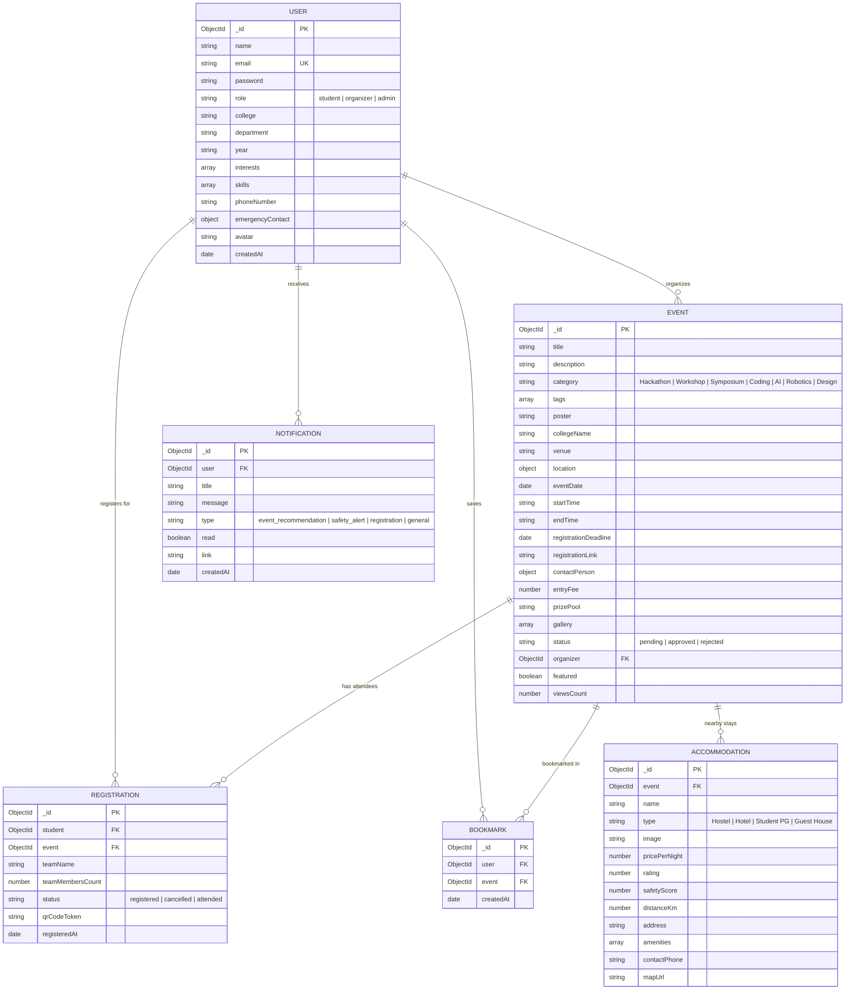

# CampusConnect - Database ER Diagram & Schema Specifications

The database for **CampusConnect** is designed using MongoDB & Mongoose schemas to support multi-role authentication (Student, Organizer, Admin), event discovery, AI recommendations, travel safety scores, and accommodation assistance.

## Entity Relationship Diagram (Mermaid)

## Schema Highlights & Indexes
1. **User Compound Constraints**: `email` is indexed uniquely.
2. **Registration Unique Index**: `{ student: 1, event: 1 }` prevents double registration for the same event.
3. **Bookmark Unique Index**: `{ user: 1, event: 1 }` ensures clean single-bookmark toggles.
4. **Geospatial & Text Indexing**: `Event` features text index on `title`, `description`, `collegeName`, and `tags` for high-performance searching.
